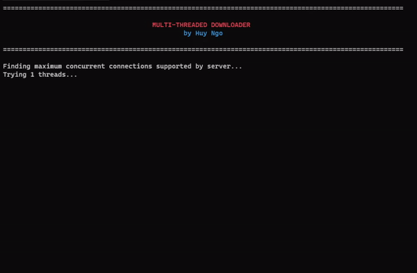

<h1 style='text-align: center'> 
    Multi-Threaded Downloader 
</h1>

 
    🚀 A CLI tool to boost download speed using multi-threading ⚡

     
    <i>Testing done on a local Apache2 server with a bandwidth limit</i>

## Table of Contents

1. [Video Representation](#video-representation)
2. [Introduction](#introduction)
3. [Features](#features)
4. [Building](#building)
5. [Usage](#usage)
6. [Structural Overview](#structural-overview)
7. [Design Choices](#design-choices)
8. [Testing and Evaluation](#testing-and-evaluation)
9. [Future Plans](#future-plans)
10. [Related Documentation](#related-documentation)
11. [Contact](#contact)

## Video Representation

[Link to slides (Google Drive)](https://docs.google.com/presentation/d/1nhj7cSnVgLJBHQSCTO3mbuXX9mjSJjHa/edit?usp=sharing&ouid=108359200637556369183&rtpof=true&sd=true)

[Link to video representation (YouTube)](https://www.youtube.com/watch?v=CUEcw_lixcQ)

## Introduction

Browsers, by default, use a single-threaded downloading approach and does not make full use of the resources available to them. Additionally, some web servers only enforce a speedcap over a single connection, so by spawning multiple download threads from a single host, we can not only maximize the resources available to us, we can sometimes circumvent the download limits set by the servers too. Both of these factors can help boost our download speed to a substantial amount, only limited by our available bandwidth.

**Multi-Threaded Downloader (`mtdown`)** is a tool created exactly for this purpose: to provide a fast and efficient way to download files from a provided Internet URL.

<i>NOTE: I don't want to be misleading, so even though I'm confident it can raise your download speed compared to a single connection, results may vary across devices and network conditions. As this project mainly aims to demonstrate usage of multi-threading, the networking factors are out of scope.</i>

## Features

✅ Multi-threaded (users can spawn many processes for different URLs for an even more parallelized experience)

✅ Easy-to-use, Beautiful CLI

✅ Robust Error Handling

✅ Memory-safe and Thread-safe

✅ High Performance

✅ Quit/Pause/Resume During Download

✅ Free and Open Source ✨

## Building

Building is quick and easy, just follow the instructions below!

First, clone the repo:  
`git clone https://github.com/hdngo/multi-threaded-downloader.git`  
`cd multi-threaded-downloader`

You will then need 2 additional libraries to build this project from scratch:

- libcurl (for downloading files from servers)
- ncurses (for non-blocking input reading)

Install them using the following command:  
`sudo apt-get install libcurl4-openssl-dev libncurses5-dev libncursesw5-dev`

Once that is done, we will compile it with `gcc` using the following command:  
`gcc mtdown.c -o mtdown -lcurl -lncurses -w`

You have succesfully built this project, congrats!

If you want to extend the project at a certain step, the main function provides an execution path you can use to find out where you can put your extension code.

## Usage

To run the downloader, follow this command structure:

`./mtdown -u <download url> -o ./output/path -n 4`

- **"-u"**: a valid URL to download from. This is required.
- **"-o"**: a valid path to save the file to. This is required.
- **"-n"**: the number of threads to use <1-32>. This is optional (default is 4). However, note that this number will be further limited to the max number of concurrent connections the server supports.

## Structural Overview

The program consists of 2 main components: the main thread and the worker threads.

- The main thread is in charge of managing the program logic and the threads it spawns. It will do things like parse user input, update thread/download settings, split the download, and keep track of worker progress.

- The worker threads are the ones doing the actual downloading, utilizing the "RANGE" parameter in a web request to start downloading at specified start-to-end offsets instead of downloading from start to finish. Each worker is assigned a struct so that it can keep track of everything it is doing.

## Design Choices

**Threading and Chunking Model**:

- The program follows a simple model where work (the whole file to be downloaded) is divided into a number of equally-sized chunks - the number of chunks equal to the number of threads chosen by the program. As said before, the number of threads will take into account user input, but prioritize the amount of connections the server supports.
- For the chunk dividing algorithm, a more sophisticated algorithm involving network resources would optimize the downloading further, but I found the current algorithm to be sufficiently effective and does not pose the need for a such complex solutions.
- Amongst these threads, a lock is also implemented to prevent race conditions on the variable keeping track of completed threads. This variable will be used by the main thread to decide whether to keep on waiting for threads to finish or start the post-download functions.

**Error Handling**

- All `malloc`, `fopen`, `fwrite`, etc. calls are checked for errors afterwards to prevent illegal writing to uninitialized buffers.
- Threads are also equipped with error-handling code so that they could reduce system residuals like memory leaks once a fatal error occurs.
- The program uses a global log buffer that is shared between its threads and will be populated when threads receive an error.
- For download-related problems, the threads will retry for a maximum of 4 times and abort the download if it still could not continue downloading any further.

**Allocating Memory**

- The original design used malloc'ed buffers as the source for each threads to write to, and then is later on joined together by the main thread. As you can probably guesses, this is a terrible design which not only affects performance of the machine but are also unable to download files bigger than available memory.
- Therefore, a new and faster design is implemented, which first allocates a shared file with the same length as the file to be downloaded and have all threads write to it at the same time, each thread starting at a different offset (so no race conditions and sync problems).
- Although this means the bottleneck would be disk write speed, in return it will save a lot of time (no need for combining buffers after downloading) and reduce the memory footprint to a minimum. After everything is done, the program will free all existing allocated memory buffers and return all the resources borrowed to the operating system.

## Testing and Evaluation

**Environment**

- Most testing is done on a local Apache2 server with a plugin that limits bandwidth and the amount of concurrent connections to simulate real world servers. `md5sum` and `sha256sum` is used to verify downloaded file intergrity. System resource usage is monitored using the built-in `htop` tool in Ubuntu.

**Performance**

- Low RAM usage (a few megabytes), no memory leaks, CPU usage is evenly distributed and is constant throughout the download process (does not spike). However, further testing on extremely slow servers and HDD disk drives is needed for full performance evaluation.

**Reliability**

- The program can reliably pause and resume downloads on user command, and is able to log and retry when the connection drops briefly without affecting final file intergriy. Large files (5GB+) do not seem to cause any issues in performance either.

## Future Plans

- Custom Bandwidth Throttling
- User-chosen Scheduling
- Resume from Crashed Download

## Related Documentation

- [libcurl](https://curl.se/libcurl/c/libcurl.html)
- [ncurses](https://invisible-island.net/ncurses/man/ncurses.3x.html)
- [http response codes](https://developer.mozilla.org/en-US/docs/Web/HTTP/Status)

## Contact

 
hdngo@gmail.com

